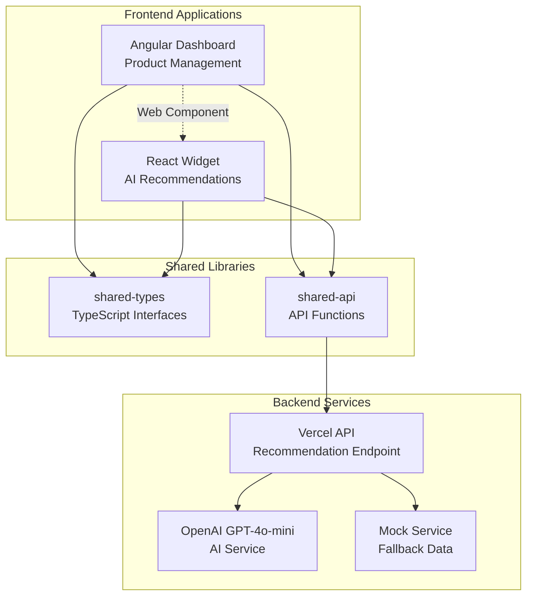

# TechStore - AI-Powered E-commerce Platform

A modern full-stack e-commerce application that combines Angular and React in an Nx monorepo to create a complete online shopping experience. The application features a comprehensive Angular-based e-commerce platform with integrated React-powered AI recommendation widgets using OpenAI's GPT-4o-mini.

## 🛒 E-commerce Features

- **Complete Shopping Experience**: Product browsing, detailed product pages, shopping cart, and checkout flow
- **Category Management**: Organized product categories with filtering and sorting capabilities
- **Deals & Promotions**: Flash sales, daily deals, weekly specials, and clearance sections
- **Shopping Cart**: Persistent cart with quantity management and local storage
- **Checkout Process**: Complete checkout flow with shipping and payment forms
- **Order Success**: Professional order confirmation with tracking information

## 🚀 Technical Features

- **Hybrid Framework Architecture**: Angular e-commerce platform with embedded React AI widgets
- **AI-Powered Recommendations**: OpenAI GPT-4o-mini integration with intelligent fallback system
- **Modern State Management**: RxJS for Angular, Redux Toolkit Query for React
- **Web Components Integration**: Seamless cross-framework communication
- **Responsive Design**: Mobile-first design with Tailwind CSS
- **Comprehensive Error Handling**: Graceful degradation and user-friendly error messages
- **Production Ready**: Configured for Vercel deployment with proper build optimization

## 📋 Table of Contents

- [Quick Start](#quick-start)
- [Installation](#installation)
- [Development](#development)
- [Architecture](#architecture)
- [API Documentation](#api-documentation)
- [Testing](#testing)
- [Deployment](#deployment)
- [Troubleshooting](#troubleshooting)
- [Contributing](#contributing)

## 📚 Additional Documentation

- **[Installation Guide](./INSTALLATION.md)** - Detailed setup instructions for all platforms
- **[Architecture Documentation](./ARCHITECTURE.md)** - Technical architecture and design decisions
- **[API Documentation](./API.md)** - Complete API reference and examples
- **[Deployment Guide](./DEPLOYMENT.md)** - Production deployment instructions
- **[Troubleshooting Guide](./TROUBLESHOOTING.md)** - Common issues and solutions
- **[Error Handling](./ERROR_HANDLING.md)** - Comprehensive error handling implementation
- **[Development Server](./DEV-SERVER.md)** - Local development server setup

## 🚀 Quick Start

### Prerequisites

- **Node.js**: Version 18.x or higher
- **npm**: Version 8.x or higher
- **OpenAI API Key**: Optional, for AI recommendations (falls back to mock data)

### Installation

1. **Clone the repository**:
   ```bash
   git clone <repository-url>
   cd ai-product-dashboard
   ```

2. **Install dependencies**:
   ```bash
   npm install
   ```

3. **Set up environment variables** (optional):
   ```bash
   cp .env.example .env
   # Add your OpenAI API key to .env
   OPENAI_API_KEY=your_openai_api_key_here
   ```

4. **Start development servers**:
   ```bash
   npm run dev
   ```

5. **Explore the e-commerce platform**:
   - Navigate to `http://localhost:4200`
   - Browse products, categories, and deals
   - Add items to cart and complete checkout flow
   - View AI-powered recommendations on product detail pages

> **📖 New to the project?** Check out our comprehensive [Installation Guide](./INSTALLATION.md) for detailed setup instructions, platform-specific configurations, and troubleshooting tips.

## 🛍️ User Journey

### Complete E-commerce Experience

1. **Product Discovery**
   - Browse all products on the main products page
   - Filter by categories (Laptops, Smartphones, Accessories)
   - Explore deals and promotions (Flash Sales, Daily Deals, Weekly Specials)

2. **Product Details**
   - Click any product to view detailed information
   - See pricing, features, and specifications
   - Get AI-powered product recommendations
   - Add items to cart with quantity selection

3. **Shopping Cart**
   - View all selected items in the cart
   - Modify quantities or remove items
   - See pricing breakdown with taxes and shipping
   - Proceed to secure checkout

4. **Checkout Process**
   - Enter shipping information
   - Provide payment details
   - Review order summary
   - Complete purchase with confirmation

5. **Order Success**
   - Receive order confirmation
   - Get tracking information
   - Continue shopping or view order details

## 💻 Development

### Available Scripts

| Command | Description |
|---------|-------------|
| `npm run dev` | Start both Angular and API development servers |
| `npm run build:all` | Build all applications for production |
| `npm run test` | Run all unit tests |
| `npm run test:integration` | Run integration tests |
| `npm run lint` | Run ESLint across all projects |

### Development Workflow

1. **Start development environment**:
   ```bash
   npm run dev
   ```
   This starts:
   - Angular development server on `http://localhost:4200`
   - API development server on `http://localhost:3001`

2. **Make changes**:
   - Angular components: `angular-dashboard/src/app/`
   - React components: `react-recommender/src/app/`
   - Shared types: `shared-types/src/lib/`
   - Shared API: `shared-api/src/lib/`

3. **Test your changes**:
   ```bash
   npm run test:all
   ```

### Project Structure

```
ai-product-dashboard/
├── angular-dashboard/          # Angular e-commerce application
│   ├── src/app/
│   │   ├── pages/             # Route-based page components
│   │   │   ├── products/      # Product listing page
│   │   │   ├── categories/    # Category overview page
│   │   │   ├── category/      # Individual category page
│   │   │   ├── deals/         # Deals and promotions page
│   │   │   ├── product-detail/# Product detail page with AI recommendations
│   │   │   ├── cart/          # Shopping cart page
│   │   │   ├── checkout/      # Checkout process page
│   │   │   └── success/       # Order confirmation page
│   │   ├── components/        # Reusable Angular components
│   │   └── services/          # Angular services (Cart, Product)
├── react-recommender/         # React AI recommendation widget
│   ├── src/app/
│   │   └── components/        # React components
│   ├── src/store/             # Redux store and API
│   └── src/web-component/     # Web component wrapper
├── shared-api/                # Shared API functions
├── shared-types/              # TypeScript interfaces
├── api/                       # Vercel API functions
├── integration-tests/         # Cross-framework tests
└── docs/                      # Additional documentation
```

## 🏗️ Architecture

### High-Level Overview

The application uses a hybrid architecture that combines the strengths of both Angular and React:



### Key Architecture Decisions

1. **Web Components for Integration**: React widget is wrapped as a custom element (`<react-recommender>`) for seamless Angular integration

2. **Shared Libraries**: Common types and API functions are shared between frameworks to ensure consistency

3. **Independent State Management**: Each framework maintains its own state (RxJS for Angular, RTK Query for React)

4. **Graceful Degradation**: Multiple fallback layers ensure the application always provides value to users

### Component Interactions

#### Angular Dashboard Components

- **AppComponent**: Main application shell and layout coordinator
- **ProductListComponent**: Displays product grid with selection handling
- **ProductDetailComponent**: Shows detailed product information
- **ProductService**: Centralized state management using RxJS BehaviorSubject

#### React Recommendation Widget

- **Recommender**: Main component that fetches and displays AI recommendations
- **RecommenderElement**: Web component wrapper for Angular integration
- **RTK Query API**: Handles API calls, caching, and loading states

## 📡 API Documentation

### Base URL

- **Development**: `http://localhost:3001/api`
- **Production**: `https://your-domain.vercel.app/api`

### Endpoints

#### POST /api/recommendations

Generate AI-powered product recommendations based on a selected product.

**Request Body:**
```json
{
  "productName": "MacBook Air"
}
```

**Response (Success):**
```json
{
  "recommendations": [
    {
      "name": "MacBook Pro",
      "reason": "More powerful processor and better graphics for demanding tasks"
    },
    {
      "name": "iPad Pro", 
      "reason": "Portable alternative with touch interface and Apple Pencil support"
    },
    {
      "name": "Magic Mouse",
      "reason": "Perfect wireless mouse companion for your MacBook setup"
    }
  ]
}
```

**Response (Error):**
```json
{
  "error": "Bad request",
  "message": "productName is required in request body"
}
```

**Status Codes:**
- `200`: Success
- `400`: Bad request (invalid input)
- `405`: Method not allowed
- `500`: Internal server error
- `503`: Service unavailable
- `504`: Gateway timeout

#### GET /api/health

Health check endpoint to verify API availability.

**Response:**
```json
{
  "status": "OK",
  "message": "API server is running",
  "timestamp": "2024-01-15T10:30:00.000Z"
}
```

### Error Handling

The API implements comprehensive error handling with automatic fallbacks:

1. **OpenAI API Failures**: Automatically falls back to mock recommendations
2. **Network Errors**: Provides appropriate error messages with retry suggestions
3. **Input Validation**: Validates and sanitizes all inputs
4. **Rate Limiting**: Handles API rate limits gracefully

## 🧪 Testing

### Test Structure

The project includes comprehensive testing at multiple levels:

```
tests/
├── unit/                      # Component and service tests
│   ├── angular/              # Angular component tests
│   ├── react/                # React component tests
│   └── shared/               # Shared library tests
├── integration/              # Cross-framework integration tests
└── e2e/                      # End-to-end tests (future)
```

### Running Tests

```bash
# Run all tests
npm run test:all

# Run unit tests only
npm test

# Run integration tests
npm run test:integration

# Run tests with coverage
npm run test:coverage

# Run tests in watch mode
npm run test:watch
```

### Test Coverage

The project maintains high test coverage across:

- **Angular Components**: Template rendering, event handling, service integration
- **React Components**: Component rendering, user interactions, API integration
- **Shared Libraries**: API functions, type validation, error handling
- **Integration**: Cross-framework communication, Web Component functionality

### Writing Tests

#### Angular Component Tests

```typescript
describe('ProductListComponent', () => {
  it('should emit product selection events', () => {
    const component = fixture.componentInstance;
    const product = mockProducts[0];
    
    spyOn(component.productSelected, 'emit');
    component.onProductClick(product);
    
    expect(component.productSelected.emit).toHaveBeenCalledWith(product);
  });
});
```

#### React Component Tests

```typescript
describe('Recommender', () => {
  it('should display loading state while fetching recommendations', () => {
    render(<Recommender product={mockProduct} />);
    
    expect(screen.getByText(/loading recommendations/i)).toBeInTheDocument();
  });
});
```

## 🚀 Deployment

### Vercel Deployment (Recommended)

1. **Prerequisites**:
   - Vercel account
   - OpenAI API key (optional)

2. **Deploy to Vercel**:
   ```bash
   # Install Vercel CLI
   npm i -g vercel
   
   # Deploy
   vercel --prod
   ```

3. **Configure Environment Variables**:
   - In Vercel dashboard: Project Settings → Environment Variables
   - Add: `OPENAI_API_KEY` with your API key

4. **Build Configuration**:
   - Build Command: `npm run build:all`
   - Output Directory: `dist/angular-dashboard/browser`
   - Install Command: `npm install`

### Manual Deployment

1. **Build the application**:
   ```bash
   npm run build:all
   ```

2. **Deploy static files**:
   - Upload `dist/angular-dashboard/browser/` to your web server
   - Upload `dist/react-recommender-web-component/` to serve React assets

3. **Configure API endpoints**:
   - Deploy `api/` directory to your serverless platform
   - Set environment variables for OpenAI API key

### Build Process Details

The build process creates three separate outputs:

1. **React Web Component** (`npm run build:react-web-component`):
   - Creates UMD and ES modules for the recommendation widget
   - Must be built first as Angular depends on these files
   - Outputs to `dist/react-recommender-web-component/`

2. **Angular Dashboard** (`npm run build:angular`):
   - Main application served at root URL
   - Dynamically loads React web component at runtime
   - Outputs to `dist/angular-dashboard/browser/`

3. **React Standalone** (`npm run build:react`):
   - Optional standalone React app
   - Outputs to `dist/react-recommender/`

## 🔧 Troubleshooting

### Common Issues

#### Development Server Issues

**Problem**: `Port 4200 already in use`
```bash
# Solution: Kill the process or use a different port
npx kill-port 4200
# or
nx serve angular-dashboard --port 4201
```

**Problem**: `API requests failing with CORS errors`
```bash
# Solution: Ensure dev server is running
npm run dev-server
# Check proxy.conf.json configuration
```

#### Build Issues

**Problem**: `Cannot resolve module 'react-recommender'`
```bash
# Solution: Build React web component first
npm run build:react-web-component
npm run build:angular
```

**Problem**: `TypeScript compilation errors`
```bash
# Solution: Check shared types and rebuild
nx build shared-types
nx build shared-api
```

#### Runtime Issues

**Problem**: `Recommendations not loading`
1. Check browser console for errors
2. Verify API server is running (`http://localhost:3001/api/health`)
3. Check network tab for failed requests
4. Verify OpenAI API key (optional, should fall back to mock data)

**Problem**: `React widget not appearing`
1. Check browser console for Web Component registration errors
2. Verify React assets are loaded (`/react-recommender.umd.js`)
3. Check Angular template for `<react-recommender>` element

#### API Issues

**Problem**: `OpenAI API rate limits`
- The system automatically falls back to mock recommendations
- Check console logs for fallback activation

**Problem**: `Invalid API responses`
- API includes comprehensive validation and fallback logic
- Check server logs for detailed error information

### Debug Mode

Enable debug logging by setting environment variables:

```bash
# Development
DEBUG=true npm run dev

# Production (Vercel)
# Set DEBUG=true in environment variables
```

### Performance Issues

**Problem**: `Slow initial load times`
1. Check network tab for large bundle sizes
2. Verify code splitting is working
3. Check for unnecessary dependencies

**Problem**: `Memory leaks in development`
1. Check for unsubscribed observables in Angular
2. Verify React components are properly unmounting
3. Check Web Component cleanup in `disconnectedCallback`

### Getting Help

1. **Check existing documentation**:
   - [DEPLOYMENT.md](./DEPLOYMENT.md) - Deployment specific issues
   - [ERROR_HANDLING.md](./ERROR_HANDLING.md) - Error handling details
   - [DEV-SERVER.md](./DEV-SERVER.md) - Development server setup

2. **Debug steps**:
   - Enable debug logging
   - Check browser console
   - Verify API endpoints with curl/Postman
   - Test with mock data (disable OpenAI API key)

3. **Common solutions**:
   - Restart development servers
   - Clear browser cache
   - Rebuild all applications
   - Check environment variables

## 🤝 Contributing

### Development Setup

1. Fork the repository
2. Create a feature branch: `git checkout -b feature/amazing-feature`
3. Install dependencies: `npm install`
4. Start development: `npm run dev`

### Code Standards

- **TypeScript**: Strict mode enabled, proper typing required
- **ESLint**: Configured for both Angular and React
- **Prettier**: Code formatting enforced
- **Testing**: Maintain test coverage above 80%

### Pull Request Process

1. Ensure all tests pass: `npm run test:all`
2. Update documentation if needed
3. Add integration tests for new features
4. Follow conventional commit messages

### Architecture Guidelines

- Keep frameworks loosely coupled through Web Components
- Use shared libraries for common functionality
- Implement comprehensive error handling
- Follow responsive design principles
- Maintain accessibility standards

## 📄 License

This project is licensed under the MIT License - see the [LICENSE](LICENSE) file for details.

## 🙏 Acknowledgments

- **Nx**: Monorepo tooling and build system
- **Angular**: Frontend framework for the main dashboard
- **React**: Component library for the recommendation widget
- **OpenAI**: AI-powered recommendation engine
- **Tailwind CSS**: Utility-first CSS framework
- **Vercel**: Deployment and hosting platform
