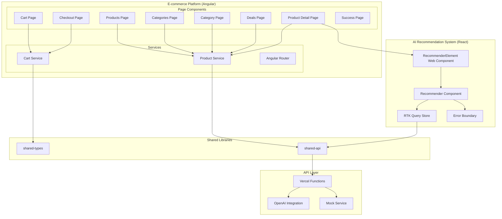
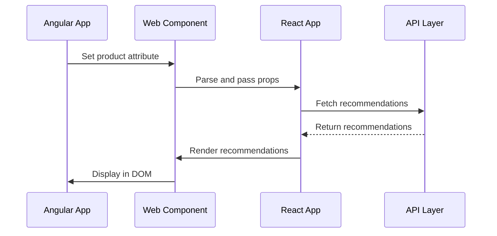
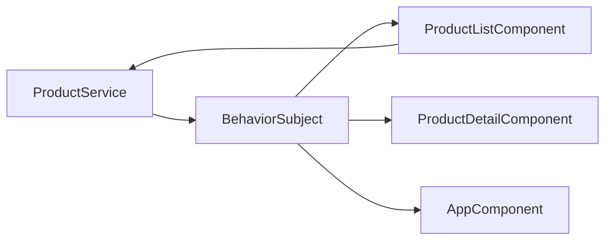
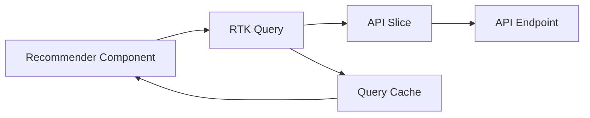
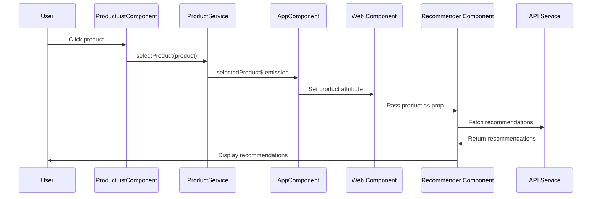
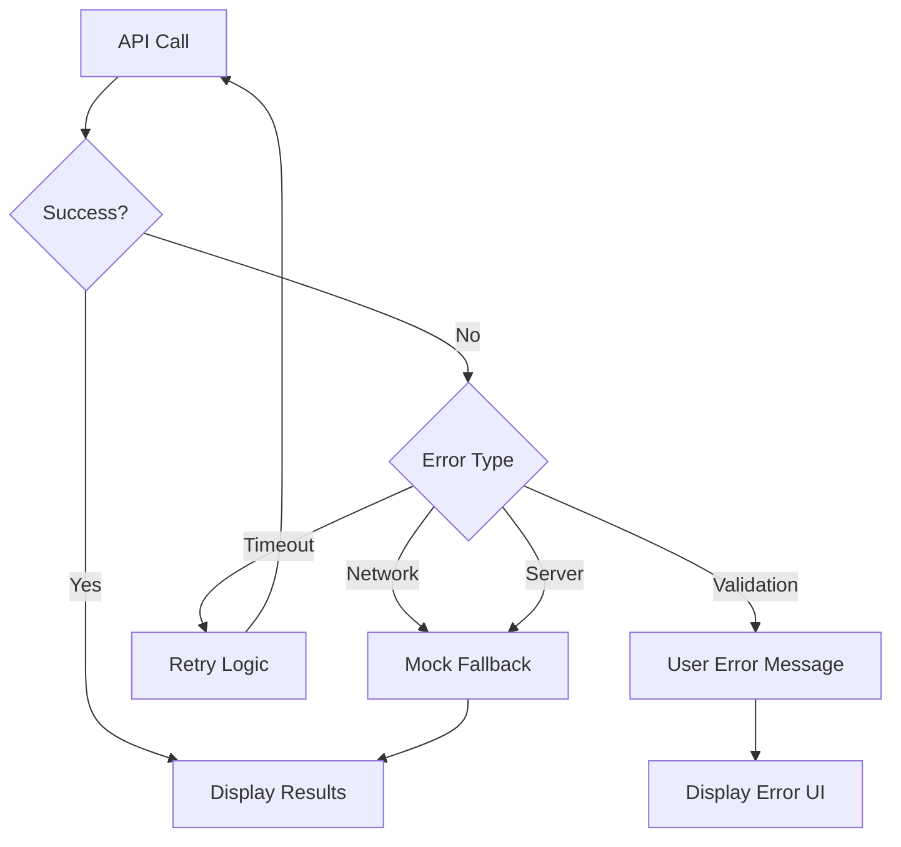
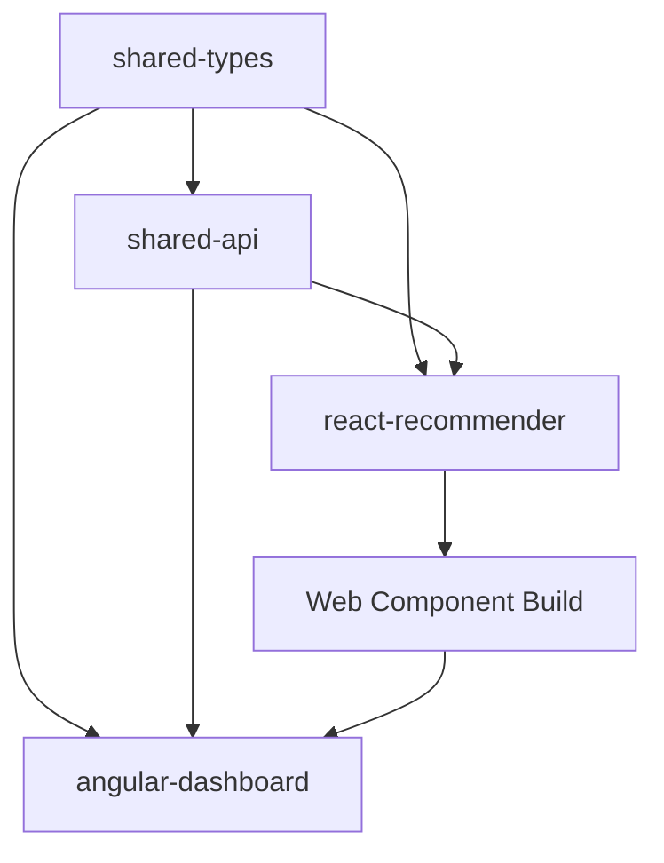
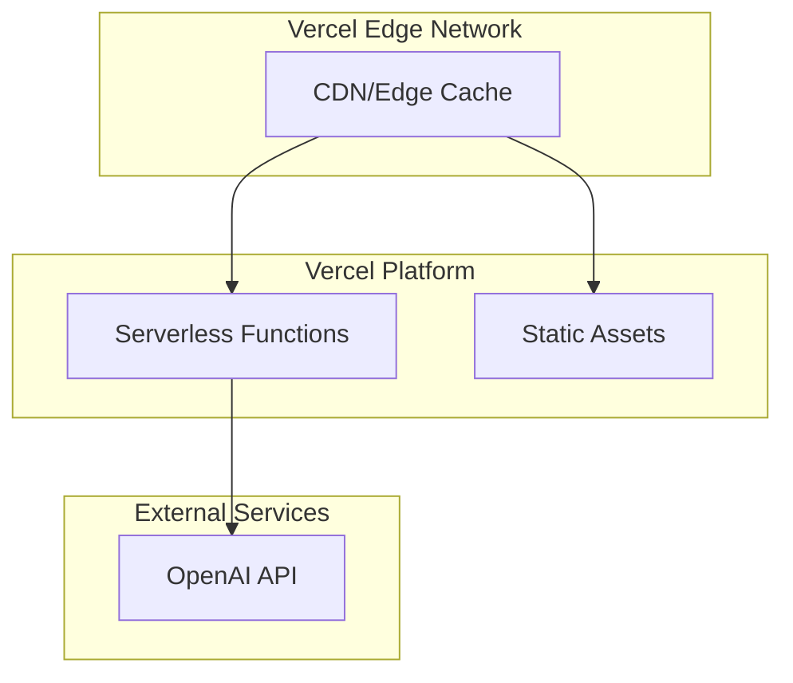

# Architecture Documentation

## Overview

TechStore is a comprehensive e-commerce platform built using a hybrid micro-frontend architecture that combines Angular and React within an Nx monorepo. The platform provides a complete online shopping experience with AI-powered product recommendations. This document provides detailed information about architectural decisions, component interactions, and design patterns used throughout the application.

## Table of Contents

- [High-Level Architecture](#high-level-architecture)
- [Framework Integration Strategy](#framework-integration-strategy)
- [Component Architecture](#component-architecture)
- [State Management](#state-management)
- [Data Flow](#data-flow)
- [Build System](#build-system)
- [Deployment Architecture](#deployment-architecture)
- [Design Patterns](#design-patterns)
- [Performance Considerations](#performance-considerations)
- [Security Architecture](#security-architecture)

## High-Level Architecture

### System Overview



### Architecture Principles

1. **Separation of Concerns**: Each framework handles its specific responsibilities
2. **Loose Coupling**: Frameworks communicate through well-defined interfaces
3. **Shared Libraries**: Common functionality is centralized in shared packages
4. **Graceful Degradation**: Multiple fallback layers ensure reliability
5. **Performance First**: Optimized for fast loading and smooth interactions

## Framework Integration Strategy

### Web Components Bridge

The integration between Angular and React is achieved through Web Components, providing a clean separation while enabling seamless communication.



### Benefits of This Approach

1. **Framework Independence**: Each framework can evolve independently
2. **Team Specialization**: Teams can work with their preferred framework
3. **Gradual Migration**: Easy to migrate components between frameworks
4. **Technology Diversity**: Leverage the best features of each framework

### Implementation Details

#### Web Component Registration

```typescript
// react-recommender/src/web-component/index.ts
class RecommenderElement extends HTMLElement {
  private root: Root | null = null;
  private product: Product | null = null;

  connectedCallback() {
    this.root = createRoot(this);
    this.render();
  }

  disconnectedCallback() {
    if (this.root) {
      this.root.unmount();
      this.root = null;
    }
  }

  attributeChangedCallback(name: string, oldValue: string, newValue: string) {
    if (name === 'product' && newValue !== oldValue) {
      try {
        this.product = JSON.parse(newValue);
        this.render();
      } catch (error) {
        console.error('Failed to parse product attribute:', error);
      }
    }
  }

  private render() {
    if (this.root && this.product) {
      this.root.render(
        <Provider store={store}>
          <Recommender product={this.product} />
        </Provider>
      );
    }
  }

  static get observedAttributes() {
    return ['product'];
  }
}

customElements.define('react-recommender', RecommenderElement);
```

#### Angular Integration

```typescript
// angular-dashboard/src/app/app.ts
@Component({
  template: `
    <div class="grid grid-cols-1 md:grid-cols-3 gap-4">
      <app-product-list
        (productSelected)="onProductSelected($event)"
      ></app-product-list>
      <app-product-detail></app-product-detail>
      <react-recommender
        [attr.product]="selectedProductJson"
      ></react-recommender>
    </div>
  `,
})
export class AppComponent {
  selectedProductJson: string = '';

  onProductSelected(product: Product) {
    this.selectedProductJson = JSON.stringify(product);
  }
}
```

## Component Architecture

### Angular Components

#### AppComponent (Shell)

**Responsibilities:**

- Application layout and routing
- Cross-component communication
- Global state coordination

**Key Features:**

- Responsive grid layout
- Event handling between child components
- Web Component integration

#### ProductListComponent

**Responsibilities:**

- Display product catalog
- Handle product selection
- Provide visual feedback

**State Management:**

- Subscribes to ProductService for product data
- Emits selection events to parent component

#### ProductDetailComponent

**Responsibilities:**

- Show detailed product information
- Handle empty states
- Responsive design implementation

#### ProductService

**Responsibilities:**

- Centralized product state management
- Reactive data streams
- Business logic encapsulation

**Implementation Pattern:**

```typescript
@Injectable({
  providedIn: 'root',
})
export class ProductService {
  private selectedProductSubject = new BehaviorSubject<Product | null>(null);
  public selectedProduct$ = this.selectedProductSubject.asObservable();

  selectProduct(product: Product): void {
    this.selectedProductSubject.next(product);
  }

  getProducts(): Product[] {
    return this.products;
  }
}
```

### React Components

#### Recommender Component

**Responsibilities:**

- Fetch AI recommendations
- Display loading and error states
- Handle user interactions

**State Management:**

- Uses RTK Query for API state
- Local state for UI interactions
- Error boundary integration

#### Error Boundary

**Responsibilities:**

- Catch JavaScript errors
- Provide fallback UI
- Enable error recovery

**Implementation:**

```typescript
class ErrorBoundary extends Component<Props, State> {
  constructor(props: Props) {
    super(props);
    this.state = { hasError: false, error: null };
  }

  static getDerivedStateFromError(error: Error): State {
    return { hasError: true, error };
  }

  componentDidCatch(error: Error, errorInfo: ErrorInfo) {
    console.error('Error caught by boundary:', error, errorInfo);
  }

  render() {
    if (this.state.hasError) {
      return this.props.fallback || <DefaultErrorFallback />;
    }

    return this.props.children;
  }
}
```

## State Management

### Angular State Management (RxJS)

The Angular application uses the Service Store pattern with RxJS for reactive state management.



**Benefits:**

- Reactive updates across components
- Memory efficient
- Angular-native approach
- Easy testing and debugging

### React State Management (RTK Query)

The React widget uses Redux Toolkit Query for API state management.



**Benefits:**

- Automatic caching and invalidation
- Background refetching
- Optimistic updates
- DevTools integration

### State Synchronization

Communication between Angular and React state is handled through:

1. **Props Down**: Angular passes data to React via Web Component attributes
2. **Events Up**: React can emit custom events that Angular listens to
3. **Shared API**: Both frameworks use the same API layer for consistency

## Data Flow

### Product Selection Flow



### Error Handling Flow



## Build System

### Nx Monorepo Structure

The project uses Nx for efficient monorepo management with the following structure:

```
ai-product-dashboard/
├── angular-dashboard/          # Angular application
├── react-recommender/         # React application
├── shared-api/                # Shared API functions
├── shared-types/              # TypeScript interfaces
├── integration-tests/         # Cross-framework tests
└── api/                       # Vercel API functions
```

### Build Dependencies



### Build Process

1. **Shared Libraries**: Built first as dependencies
2. **React Web Component**: Built second for Angular integration
3. **Angular Dashboard**: Built last, includes all dependencies
4. **React Standalone**: Built independently for testing

### Build Commands

```bash
# Build all projects in correct order
npm run build:all

# Individual builds
npm run build:react-web-component  # Must be first
npm run build:angular             # Depends on web component
npm run build:react               # Standalone React app
```

## Deployment Architecture

### Vercel Deployment Strategy



### Asset Distribution

- **Angular App**: Served from root path (`/`)
- **React Web Component**: Served from `/react-recommender-web-component/`
- **API Functions**: Served from `/api/*`
- **Static Assets**: Cached at CDN edge locations

### Environment Configuration

```javascript
// vercel.json
{
  "builds": [
    {
      "src": "dist/angular-dashboard/browser/**/*",
      "use": "@vercel/static"
    }
  ],
  "rewrites": [
    { "source": "/api/(.*)", "destination": "/api" },
    { "source": "/(.*)", "destination": "/angular" }
  ]
}
```

## Design Patterns

### Observer Pattern (Angular)

Used in ProductService for reactive state management:

```typescript
// Publisher
class ProductService {
  private selectedProductSubject = new BehaviorSubject<Product | null>(null);
  public selectedProduct$ = this.selectedProductSubject.asObservable();
}

// Subscribers
class AppComponent {
  constructor(private productService: ProductService) {
    this.productService.selectedProduct$.subscribe((product) => {
      this.selectedProductJson = JSON.stringify(product);
    });
  }
}
```

### Command Pattern (RTK Query)

Used for API operations with caching and error handling:

```typescript
// Command definition
const api = createApi({
  reducerPath: 'recommendationApi',
  baseQuery: fetchBaseQuery({ baseUrl: '/api' }),
  endpoints: (builder) => ({
    getRecommendations: builder.query<RecommendationResponse, string>({
      query: (productName) => ({
        url: 'recommendations',
        method: 'POST',
        body: { productName },
      }),
    }),
  }),
});

// Command execution
const { data, error, isLoading } = useGetRecommendationsQuery(product.name);
```

### Adapter Pattern (Web Components)

Used to adapt React components for Angular consumption:

```typescript
// Adapter
class RecommenderElement extends HTMLElement {
  // Adapts HTML attributes to React props
  attributeChangedCallback(name: string, oldValue: string, newValue: string) {
    if (name === 'product') {
      const product = JSON.parse(newValue);
      this.renderReactComponent(product);
    }
  }
}
```

### Strategy Pattern (Error Handling)

Used for different error handling strategies:

```typescript
interface ErrorStrategy {
  handle(error: Error): void;
}

class NetworkErrorStrategy implements ErrorStrategy {
  handle(error: Error): void {
    // Fall back to mock data
  }
}

class ValidationErrorStrategy implements ErrorStrategy {
  handle(error: Error): void {
    // Show user-friendly message
  }
}
```

## Performance Considerations

### Bundle Optimization

1. **Code Splitting**: Separate bundles for Angular and React
2. **Tree Shaking**: Remove unused code during build
3. **Lazy Loading**: Load React widget only when needed
4. **Asset Optimization**: Compress and optimize static assets

### Runtime Performance

1. **Virtual DOM**: React uses virtual DOM for efficient updates
2. **Change Detection**: Angular uses OnPush strategy where possible
3. **Memoization**: React components use React.memo for optimization
4. **Observable Optimization**: RxJS operators for efficient data streams

### Caching Strategy

1. **API Caching**: RTK Query provides automatic caching
2. **Static Asset Caching**: Long-term caching for built assets
3. **CDN Caching**: Edge caching for global performance
4. **Browser Caching**: Appropriate cache headers for resources

### Memory Management

1. **Subscription Cleanup**: Automatic unsubscription in Angular
2. **Component Unmounting**: Proper cleanup in React components
3. **Web Component Lifecycle**: Cleanup on disconnection
4. **Event Listener Cleanup**: Remove listeners on component destruction

## Security Architecture

### Input Validation

1. **Client-Side Validation**: TypeScript interfaces and runtime checks
2. **Server-Side Validation**: Comprehensive input sanitization
3. **XSS Prevention**: Framework-level protection in Angular and React
4. **CSRF Protection**: Stateless API design prevents CSRF attacks

### API Security

1. **Environment Variables**: Secure storage of API keys
2. **CORS Configuration**: Proper cross-origin resource sharing
3. **Rate Limiting**: Protection against abuse
4. **Error Information**: Sanitized error messages

### Content Security Policy

```javascript
// Recommended CSP headers
{
  "Content-Security-Policy": "default-src 'self'; script-src 'self' 'unsafe-inline'; style-src 'self' 'unsafe-inline'; img-src 'self' data: https:; connect-src 'self' https://api.openai.com"
}
```

### Data Privacy

1. **No Personal Data Storage**: Application doesn't store user data
2. **API Key Protection**: Keys stored securely in environment variables
3. **Minimal Data Collection**: Only necessary data is processed
4. **Transparent Fallbacks**: Clear indication when mock data is used

## Monitoring and Observability

### Error Tracking

1. **Client-Side Errors**: Error boundaries and global error handlers
2. **API Errors**: Comprehensive logging and categorization
3. **Performance Monitoring**: Core Web Vitals tracking
4. **User Experience**: Error impact on user workflows

### Logging Strategy

1. **Structured Logging**: Consistent log format across services
2. **Log Levels**: Appropriate levels for different environments
3. **Error Context**: Detailed context for debugging
4. **Performance Metrics**: Response times and success rates

### Health Monitoring

1. **API Health Checks**: Regular health endpoint monitoring
2. **Dependency Monitoring**: External service availability
3. **Performance Alerts**: Automated alerts for degraded performance
4. **User Impact Tracking**: Real user monitoring metrics

This architecture provides a solid foundation for a scalable, maintainable, and performant application that leverages the strengths of both Angular and React while maintaining clean separation of concerns and comprehensive error handling.
